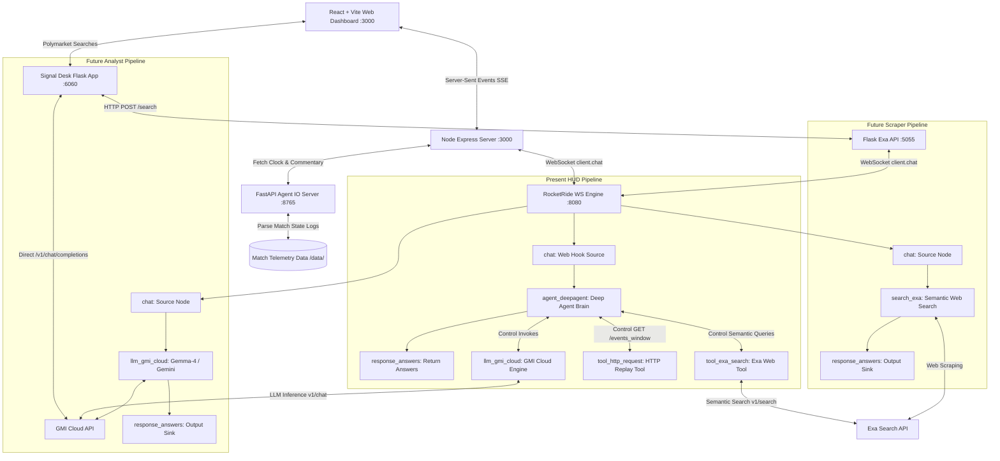

# 🏆 EdgeCast — Dual-Horizon Sports Arbitrage & Prediction Scout

> **Pitch-Side Match Telemetry Meets Live Polymarket Prediction Intelligence.**  
> Built for the 2026 World Cup Hackathon. An automated AI trading scout that connects real-time football pitch event telemetry with live Polymarket prediction pricing to capture market mispricings in real-time.

---

## ⚡ Project Vision & The Dual Horizons

Prediction markets move in milliseconds, but human traders take minutes to evaluate match events, substitutions, injury momentum, and field pressure. **EdgeCast** solves this by establishing two coordinated analytical horizons:

1. **The Present (EdgeCast HUD)**: A cyberpunk, high-density dashboard that watches a live football match. It streams real-time play-by-play events and lists hot contract opportunities that are shifting rapidly in price. Powered by `test.pipe`.
2. **The Future (Signal Desk)**: A scouting engine that scans active Polymarket prediction contracts, automatically triggers semantic scrapers to gather external evidence, and produces structured risk/reward cards backed by LLM evaluations. Powered by `exa-search-working.pipe` and `gmi-ranker-working.pipe`.

---

## 🗺️ Coordinated System Architecture

Here is the complete end-to-end data and control flow showing how the **Present (EdgeCast HUD)** and **Future (Signal Desk)** pipelines operate and coordinate through the local RocketRide WebSocket engine:



---

## 🎛️ Local Port & Service Directory

All five core servers reside in your local environment, running in dedicated Conda and Node processes:

| Service | Port | Endpoint Role | Description |
| :--- | :--- | :--- | :--- |
| **Express + Vite UI** | `3000` | `http://localhost:3000` | Cyberpunk React trader dashboard and core client backend. |
| **FastAPI Replayer** | `8765` | `http://localhost:8765` | Telemetry replayer replaying key commentaries and token prices. |
| **Signal Desk App** | `6060` | `http://localhost:6060` | Polymarket analyst Flask dashboard and betting scout. |
| **RocketRide Engine** | `8080` | `ws://localhost:8080` | Local WebSocket proxy executing all orchestrated `.pipe` models. |
| **Exa Search API** | `5055` | `http://localhost:5055` | Search gateway wrapping RocketRide's Exa scraper over HTTP. |

---

## 🛠️ Step-by-Step Setup & Run Instructions

To run the entire EdgeCast ecosystem cleanly from your terminal:

### 1. Configure the Environment
Ensure you have a `.env` file at the root of the workspace containing:
```bash
EXA_API_KEY=your_exa_api_key
ROCKETRIDE_EXA_KEY=your_exa_api_key
GMI_API_KEY=your_gmi_cloud_jwt
ROCKETRIDE_GMI_API_KEY=your_gmi_cloud_jwt
ROCKETRIDE_URI=ws://localhost:8080/task/service
EDGECAST_MATCH_ID=ars-man-2026-04-19
EDGECAST_TICK_SECONDS=60
EDGECAST_WEBHOOK_URL=http://localhost:8080/webhook?token=test.pipe
```

### 2. Launch Server 1: RocketRide Engine (Port 8080)
Load the variables and start the engine WebSocket proxy:
```bash
cd "/Users/sajayudhay/Library/Application Support/RocketRide/engine"
set -a; source /Users/sajayudhay/github_projects/world-cup-hack-2026-1/.env; set +a
./engine --autoterm ./ai/eaas.py --host=127.0.0.1 --port=8080
```

### 3. Deploy and Register the Pipeline (`test.pipe`)
Register the pipeline configuration in the running engine:
```bash
cd /Users/sajayudhay/github_projects/world-cup-hack-2026-1
curl -i -X POST "http://localhost:8080/task?token=test.pipe" \
  -H "Authorization: Bearer MYAPIKEY" \
  -H "Content-Type: application/json" \
  -d @test.pipe
```

### 4. Launch Server 2: Teleplayer FastAPI Server (Port 8765)
```bash
cd /Users/sajayudhay/github_projects/world-cup-hack-2026-1
python -m uvicorn scripts.agent_io_server:app --host 0.0.0.0 --port 8765
```

### 5. Launch Server 3: RocketRide Exa Search API (Port 5055)
```bash
cd /Users/sajayudhay/github_projects/world-cup-hack-2026-1/future
python api.py
```

### 6. Launch Server 4: Polymarket Signal Desk (Port 6060)
```bash
cd /Users/sajayudhay/github_projects/world-cup-hack-2026-1/future
python oracle_app.py
```

### 7. Launch Server 5: Express + Vite UI Dashboard (Port 3000)
```bash
cd /Users/sajayudhay/github_projects/world-cup-hack-2026-1/sports-arbitrage-ai-agent-workspace
npm run dev
```

Open **[http://localhost:3000](http://localhost:3000)** in your web browser and start trading!

---

## 🗃️ Under the Hood: Pipeline Node Configuration

### 📦 The Present HUD Pipeline (`test.pipe`)
* **Web Hook Source (`webhook_1`)**: Ingress node (type `chat`) which captures the live match states and queries.
* **Deep Agent (`agent_deepagent_1`)**: Connects to the inputs, evaluates prediction pricing, dedups against history, and emits opportunity briefs.
* **GMI Cloud LLM (`llm_gmi_cloud_1`)**: Reasoning engine powered by `google/gemini-3.5-flash` at `api.gmi-serving.com`.
* **HTTP Replay Tool (`tool_http_request_1`)**: Custom REST client tool allowing the agent to dynamically crawl match logs on `:8765`.
* **Exa Semantic Search Tool (`tool_exa_search_1`)**: Agent tool performing neural internet lookups for live pitch evidence.
* **Return Answers (`response_answers_1`)**: Direct sink node exposing the final analyst recommendations.

### 📦 The Future Pipelines (`future/` microservices)
* **`exa-search-working.pipe`**: Streams natural language questions into the high-performance `search_exa` node to fetch Google-alternative search highlights with characters matched at 600-char intervals.
* **`gmi-ranker-working.pipe`**: Feeds candidate names and Exa search highlights into the `llm_gmi_cloud` node to return bullets detailing why prediction prices represent structural value.
